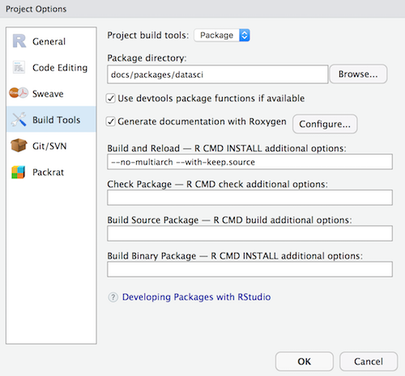

# Data Science for Industry: R Packages

This directory contains companion resources for the R packages lesson of [Data Science for Industry](https://github.com/iandurbach/datasci-fi).

Note that since the example `datasci` package here is located within a sudirectory and not the project root, you will need to configure RStudio's Build Tools as shown below:

> Build -> Configure Build Tools

Select Package in the Project build tools dropdown.

Update the package directory to `docs/packages/datasci`

You should then be able to use Build -> Load all / Build & Reload etc and other integrated package tooling within RStudio.

Another option is to just copy the package directory `packages/datasci` to a new location and create a new R project using the existing directory.
