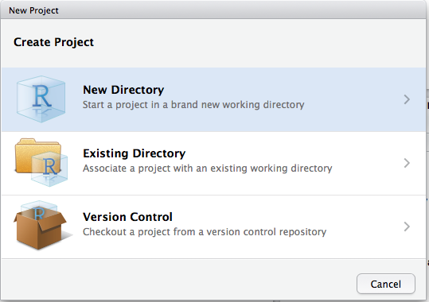
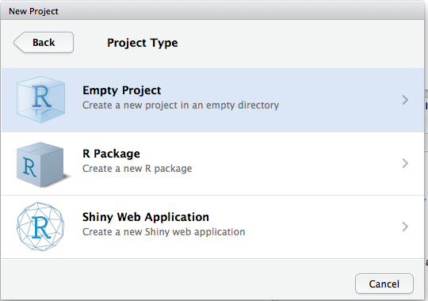
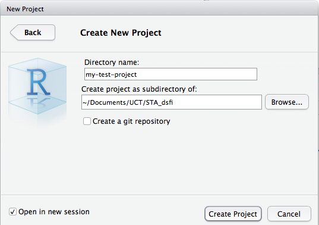
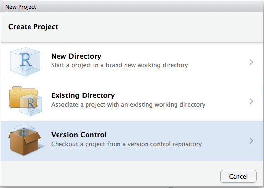
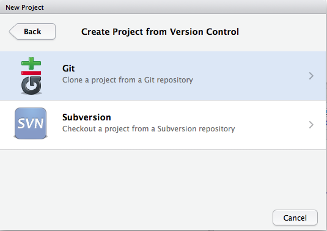
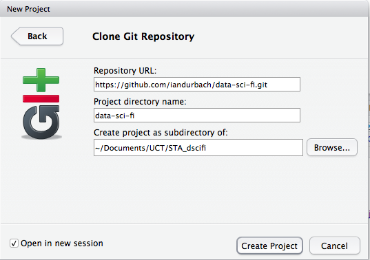
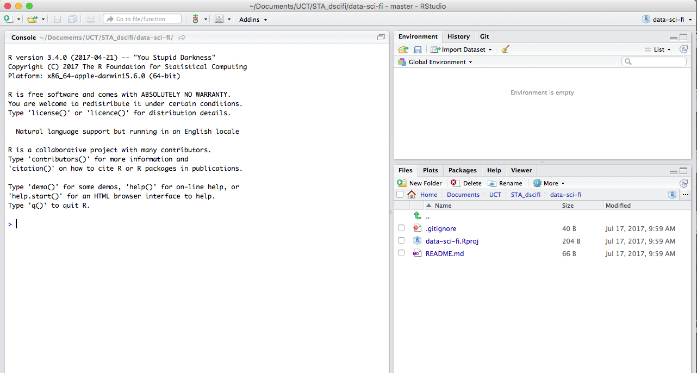
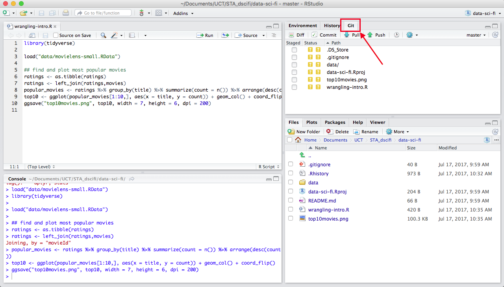

```{r setup, include=FALSE}
knitr::opts_chunk$set(echo = TRUE)
#knitr::opts_knit$set(root.dir = "")
```

A good workflow should save you time, make it easier to find and fix errors, clearly document your analysis steps, and make it easy to update and rerun your analysis, for example if more data becomes available. When done correctly it will bring a deep sense of inner calm from knowing that everything is in its right place. 

The workflow we'll use for much of this course is based on a combination of the following three tools:

* **R Projects** for keeping track of the various files and folders that are part of a project (scripts, data, figures) and organising these in some way as the project proceeds;

* **Git** for version control, sharing code, and communicating code and associated results;

* **Markdown** and **R Markdown** for communicating our work to the outside world. 

Each of these can be used in their own right, but their real value comes from using them together. The reasons for this will become clear as we go, but (briefly): RStudio provides a really easy way to integrate R Projects with GitHub; GitHub automatically displays Markdown files as readable HTML (or HTML-like) documents, and R Markdown files are basically the formatted output of your R scripts plus whatever else you'd like to add, like explanatory text, code, etc. That means that once everything is set up nicely, your final document can more-or-less write itself as you progress through your analysis. 

# R Projects

First introductions to R usually start by asking the new user to enter some commands at the command line, 

```{r}
runif(5) + 3
```

This quickly becomes cumbersome: for one thing, you need to retype your commands each time you restart R. So people quickly move along to saving their commands in script files, which are basically text files containing a list of saved commands that R will recognise. This makes it easy to experiment in the console, figure out which code you want to keep, and save that code to the script file for later use. As a bonus, you can also run the whole script file at once by hitting Cmd/Ctrl + Shift + S, rather than having to run code line-by-line.

R Projects are a way to keep all files associated with a project in one place. Most people will do this themselves, in some way. For example, when I used to start a project, I would start a new folder with the name of the project, say `bank_fraud_detection`, then have a few subfolders with stuff I knew I would end up with: `past_papers`, `code`, `results`. Essentially, RStudio just provides support for this kind of structured process with its projects. Added bonuses (and the real reasons for using projects, rather than just organising the script files yourself) are:

* Easy integration with GitHub
* No need to set working directories (you only need relative paths)
* You can see any mess you've made while working in RStudio. This is a surprisingly powerful motivation to keep things neat and organised. 

Starting a project in RStudio is trivial, although it may take a little while to get used to using them, depending on how you work and how familiar with R you are.

From RStudio, select *File* then *New project*. For now, we'll just set up a basic project, with no GitHub integration, just to get started.

```{r, echo=FALSE, out.width="290px"}



```


Any files you now save to this folder will be associated with the project. These can be files you create and save from R, or other files (e.g. data) that you copy into the folder independently of R.

You can find more information on [console-based](http://r4ds.had.co.nz/workflow-basics.html), [script-based](http://r4ds.had.co.nz/workflow-scripts.html), and [project-based](http://r4ds.had.co.nz/workflow-projects.html) workflows in R in Hadley Wickham and Garrett Grolemund's R4DS book.

# Git and GitHub

> The information in this section is a small part of Jenny Bryan's excellent [*Happy Git and GitHub for the userR*](http://happygitwithr.com/). More advanced material is [here](http://www-cs-students.stanford.edu/~blynn/gitmagic/).

## Getting started 

Git can do a lot of things, and this complexity can be overwhelming at first. I struggled (several times) to get a working understanding of version control with Git, so I've written this as the kind of very simple "how to" guide I would have liked to have had. If you already know how to use Git, or are more computer savvy than me, you might find it too elementary -- skip ahead as you see fit. 

Here are two things to keep in mind when getting started:

1. *Git*, *GitHub*, and a *Git client* go together. You need to know how to use them all (unless you plan on using the command line exclusively).
2. Most of what we'll do requires only the basics of Git. You can pick up the rest later.

Let's first look at how *Git*, *GitHub*, and a *Git client* fit together:

**Git**: Git is a version control system -- a way of keeping track of changes to a file over time (like "track changes" in Microsoft Word, for example). Originally used for source code, Git is now used by data scientists to track a set of files associated with a project over time. Git calls the set of files a *repository*, and it can contain data files, code, documents.

**GitHub**: Git is a program that lives on your computer. You could, if you wanted to, only ever use it locally to back-up your files. Most people though, use Git as a way to collaborate on projects, and share code and associated files. That needs some way of hosting Git-based projects on the internet, which is where *GitHub* comes in. GitHub is a web platform that hosts/stores Git-based projects. There are other hosting services out there, but we'll just focus on GitHub.

**Git client**: Git can either be run through the command line or using a helper application like a GUI that assists with the process. The helper application is called a client. Some users prefer the command line, and indeed there are some things that can only be done through the command line, but when getting started the use of a client can be a huge help. The good news is that RStudio comes with an inbuilt Git client, which is enough for most of our needs.

There are two "phases" to using R with GitHub:

1. *Setting up*. This involves installing Git, getting a GitHub account, connecting local Git with GitHub, and connecting RStudio with local Git. This can be a bit of a pain, but the good news is 
    + you only need to do this once, 
    + there are excellent instructions online (see the next section)
    + I (or someone else) will provide help to get you set up, if needed.

2. *Working with GitHub*. This basically just involves remembering to do two things:
    + linking any new R projects to a GitHub repository
    + periodically saving your changes ("committing") and uploading these onto GitHub ("pushing")

We'll look at each of these in turn.

## Setting everything up 

This is really difficult to do in class -- inevitably there will be one or two problems but it is impossible to know what these will be, and troubleshooting them will take up valuable time. So, I've asked you to **please set up your system in advance** using the following steps:

1. Follow the basic instruction steps [here](http://happygitwithr.com/workshops.html). These are the best instructions I've found and most common problems are covered.
2. If you have trouble with any of the steps, send me an email or post to the forum and I (or others) will try to help.

## An intro to working with Git through the command line

We'll mainly use Git through RStudio, which offers a simple Git client. But first we'll introduce Git by using it on the command line. The following is a kind of minimal set of instructions that will showcase some of the basic Git functionality. I don't go into much detail here -- the idea is to discuss what's going on in class, and you can repeat the steps here later if you like.

### Saving your work: git add, git commit
1. Open the shell/terminal and cd to the directory you want to work in.
2. `git init`. This sets up an (empty) git repository in the folder.
3. `git status`. A useful command to see what files are being tracked.
4. Make a text file with "this is the first line." in it, save to the working directory as *demotext.txt*.
5. `git status`
6. `git add demotext.txt`. Adds *demotext.txt* to the staging area.
7. `git status`. Note status of *demotext.txt* has changed.
8. `git commit -m "added first line"`. Commits with a message (-m). 
9. `git status`
10. `git log`. Shows the commit history.
11. Now add a second line of text to *demotext.txt*: "this is the second line."
12. `git status`
13. `git diff demotext.txt`. See changes to *demotext.txt*.
14. `git add demotext.txt`
15. `git status`
16. `git commit -m "added second line"`
17. `git status`
18. `git log`
19. Now add a third line of text to *demotext.txt*: "this is the third line."

### Going back in time: git checkout, git revert, git reset
1. Say we don't want the third line, and want to return to the state at the last commit.
2. `git checkout demotext.txt`. Returns *demotext.txt* to state at last commit. If you put a commit id after `git checkout` returns the file to state at that commit.
3. Say we'd committed the change before we realised we didn't want it.
4. Add back the third line of text to *demotext.txt*, save, and add and commit with the message "added third line".
5. `git log —-oneline` to get the id of last commit (the one where you added the third line).
6. `git revert <commit_id>`
7. `git log`
8. Open up *demotext.txt* to see the third line is gone.
9. You can also ‘revert a revert’.
10. `git log —-oneline` and find the last commit id (the revert).
11. `git revert <commit_id>`
12. Check *demotext.txt* to see the third line is back.
13. You can also use git checkout for this.
14. `git log —-oneline`, look for commit id for the "added second line"" commit.
15. `git checkout <commit_id> demotext.txt`
16. Check *demotext.txt* to see we're back to having just two lines.
17. Suppose we realise we’ve made a bit of a mess and want to get rid of the last few commits and just return to the "added second line" commit.
18. `git log —-oneline` and find commit you want to return to.
19. `git reset —-hard <commit_id>`. This removes intermediate commits, so use with caution!

### Trying something new: git branch, git checkout
1. Say you want to try something new on *demotext.txt*. Can do this with branching, which creates a separate branch to work on, without affecting the master branch. Later on you can merge the branch back with the master or delete the branch without merging.
2. `git checkout -b test-feature` (equivalent to `git branch test-feature` plus `git checkout test-feature`)
3. Make some changes to *demotext.txt*. I added a line "some changes I'm not sure will work!".
4. `git add demotext.txt`
5. `git commit -m "testing feature 1"`
6. Check *demotext.txt*, see that feature is there.
7. `git checkout master`. Returns to the master. 
8. Check *demotext.txt*, verify its back to the old version without the feature.
9. Add a line "this is the third line"" to *demotext.txt*, add and commit. Remember we're still on the master branch, so this is an update to the master.
10. `git checkout test-feature`. Back to the test branch.
11. `git merge master`. Merge with the master branch.
12. Git tries to merge automatically, but if you get a merge conflict you need to resolve it manually, then add and commit the resolved version.
13. Open *demotext.txt* in a text editor, fix it up, then add and commit.
14. Add a new line to *demotext.txt* "another test feature"", add and commit with message "testing feature 2".
15. `git checkout master`. Returns to master branch.
16. Check *demotext.txt*, see none of the test feature text appears.
17. `git merge test-feature`. Pulls test features into the master by merging with the test branch.
18. Check *demotext.txt* to see test features have been included.
19. `git branch -v`. See the last commits on each branch.
20. `git branch -d test-feature`. Delete the *test-feature* branch.

### Going online: git push, git pull
All of what we've done so far has involved local changes. Often you'll want to also save your commits online, in which case you need to "push" your commits to an online hosting platform for Git-based projects (like GitHub). If you want to share your work with others, or work collaboratively, you'll also need GitHub or an equivalent.

1. Create a GitHub repository. Goto https://github.com, log in, find your way to "Repositories", and click the green "New" button.
2. Give your repo a name and description. 
3. Don't tick the box "Initialize this repository with a README"
4. Click "Create repository"
5. Click on the green "Clone or download" button and copy the URL in the box, which will be something like `https://github.com/iandurbach/myproject.git` (if you're using SSH, this is also where you can get the SSH key and passphrase).
6. Back in the shell/terminal, cd to the directory you've been working in.
7. `git remote add origin <URL>`. "origin" refers to the name of the remote, you can call it whatever you want.
8. `git pull origin master`. Pulls any changes from the online repo to your local master. There won't be anything in the online repo yet so nothing will happen (unless you initialized the repo with a README, in which case that will be pulled).
9. `git push origin master`. Pushes your commits to GitHub.
10. Check the appropriate file(s) are on GitHub.

If you ever want to remove a remote, use `git remote rm origin` (remember origin is just the name of the remote, your's might be different). If you want to point the remote to another URL use `git remote set-url origin <newURL>`.

## Working with Git and GitHub through RStudio

In this section we'll set up an R Project and link it to a GitHub repo. That will make it easy to push changes we make in RStudio to GitHub, from within RStudio.

### Make a new repository on GitHub 
Use the instructions above, except this time tick the box "Initialize this repository with a README". I called my project *data-sci-fi*; you can call yours whatever you like. 

### Start a new R project in RStudio 

We've done this step before, but this time we're going to link the new project to GitHub (we're cloning an empty GitHub repository).

1. Start RStudio

2. Under File, choose New Project and then Version Control and finally Git

```{r, echo=FALSE, out.width="290px"}



```

3. Paste the URL you copied from GitHub at the end of the previous step into the "Repository URL" box. You can always log back into GitHub and find this URL if you need to.

4. Give the project a directory name and choose where you want to create it. Think about where you want to create the project i.e. put it somewhere on your computer that makes sense, and that you won't want to change later on.

5. Tick the "Open in new session" box

6. Click "Create project"

If everything works you should now see a screen like the one below: a brand new R project, as before, but one that is also linked to the remote GitHub repository you set up previously. 

```{r, echo=FALSE, out.width="900px"}

```

### Do something 

In this step you just "do something" you would usually do in R. For example:

1. Use your browser or file manager (e.g. Windows Explorer, Finder) to browse to the project folder you just created. In this folder, create two new folders, one called "data" and another called "output". 

2. Go back to RStudio and verify that the new folder and file has been detected.

3. Open a new script file (Cmd/Ctrl + Shift + N) and type the following code in it:

```{r, eval = FALSE}
library(ggplot2)

# create some data
x <- runif(100)
# save as RData file
save(x, file = "data/randomnumbers.RData")

# some workings
y <- 2*x 
mydata <- data.frame(y = y, x = x)
xyplot <- ggplot(mydata, aes(x = x, y = y)) + geom_point()
ggsave("output/xyplot.png", xyplot, width = 7, height = 6, dpi = 200)
```

4. Save the script file as "first-commit.R". Run the script file. Verify that both the script file, the data, and the output plot are saved in the project directory.

### Commit the changes you just made

Commiting saves changes locally -- like taking a snapshot of your files at a particular point in time. 

1. In RStudio, click the "Git" tab. 

```{r, echo=FALSE, out.width="900px"}

```

2. Choose the files you want to commit by ticking the "Staged" box (for those you want to commit). Particularly early on, think about what you do and don't want to commit and push. Its advised to push source code that creates data and plots, rather than the data and plots themselves. Also, the way we are using GitHub, everything you push is publicly available, so you may not want to put your data or brilliant new idea up for all to see and use. Private repos are available and just cost a bit of money or additional time and effort to set up. Note though, that you can commit and push any file -- data, figures, as well as code.

3. Click "Commit", which will open up a new pane. Here you'll be able to see any changes to existing files that you'll be committing. For now all the files are new, so there's nothing to see. For each commit, you need to add a "Commit message" in the text box provided. For now, type "first commit" or similar, and then click "Commit". 

Your changes are now committed.

### Push your local commits to GitHub 

Pushing saves your changes on the remote repository. You'd always commit first, before pushing, so these steps start off at the end of a commit step, just after you click "Commit".

1. Click the blue "Pull" tab. This checks that there is not a more recent copy of your files on GitHub. If you're working on your own this will obviously be the case, but if you are collaborating someone may have pushed their changes since you last pulled, and this can create conflicts. Pull-before-push is therefore a useful habit to get into. You should get a message saying "Already up-to-date". Close this window.

2. Click the green "Push" tab. This will push your changes onto the GitHub repo. Once complete, you can close the window and the main pane you have been using. Go to your repo on GitHub, refresh the browser, and check that the changes have been uploaded. 

## Collaborating with others on GitHub

This section assumes there is an existing GitHub repo that you would like to interact with, by using the code in the repo and/or by contributing code to the repo yourself. These steps will also work in *starting* a collaborative project -- you'll just start by forking an empty repo (belonging to the person you're collaborating with).  

1. Fork the target repo to your own GitHub account. Do this by browsing to the target repo on GitHub and clicking the "Fork" button. This creates your own copy of the repo.
2. You can now clone the repo to your local machine. From *your* GitHub account, get the repo's URL by clicking the "Clone or download" button as before.
3. Start a new R project using version control as shown before (*File > New Project > Version Control > Git*). Enter the URL you copied in the previous step. You should see the contents of the target repo in your R project.
4. You can now work on the project and commit and push any changes in exactly the same way described previously. If you're not interested in developments in the target repo, or in collaborating by contributing changes to the target repo, then you don't need the following steps. Often though, you will want to keep your forked repo up-to-date with the target repo (either to keep track of new developments or because you are working together in some way). In that case, read on.
5. To keep a forked repo up-to-date with the target repo, you first need to configure a remote that points from your repo to the "upstream" target repo. First check the current remote repository for your fork by opening the terminal, browsing to the project directory and typing `git remote -v`. You should see the URL of your repo.
6. Add the upstream target repo by typing `git remote add upstream https://github.com/ORIGINAL_OWNER/ORIGINAL_REPOSITORY.git`. Type `git remote -v` again to check that it has been added.
7. You can now pull any updates from the target repo into your local repo (fork) with `git pull upstream master`.

If you are going to be contributing changes to the target repo, you should now create a new branch and do your work there, rather than working directly in the master branch. When you are ready to push your changes upstream to the target repo, you do this by opening a pull request:

1. Browse to the main page of the target repo.
2. In the "Branch" menu, choose the branch that contains your commits.
3. Click "New pull request".
4. Choose the branch of the target repo you want to merge your changes with.
5. Enter a title and description for your pull request.
6. Click "Create pull request".

The pull request is then sent to the owner of the target repo, who may accept the request, ask for additional changes, or reject the request. 

### Sources and further resources

1. http://happygitwithr.com/ 
2. http://www-cs-students.stanford.edu/~blynn/gitmagic/
3. https://www.atlassian.com/git/tutorials/resetting-checking-out-and-reverting
4. https://github.com/blog/2019-how-to-undo-almost-anything-with-git
5. https://guides.github.com/activities/forking/
6. https://help.github.com/articles/fork-a-repo/
7. https://help.github.com/articles/configuring-a-remote-for-a-fork/
8. https://help.github.com/articles/syncing-a-fork/
9. https://www.youtube.com/watch?v=u-kAeG4jkMA

# R Markdown

> I've assumed a certain level of familiarity with writing documents in both markdown and R markdown, so this section is just an overview with a brief section on viewing Markdown documents on GitHub.

Markdown is a simple mark-up language for writing documents. Files written in Markdown can be converted to HTML (or many other document formats) and end in .md. The "knit HTML" button in RStudio can be used to compile a Markdown document to HTML and open a preview.

R Markdown is very similar: it is Markdown with runnable chunks of R code added in. Files written in R Markdown end in .Rmd or .rmd. They can also be converted to HTML and other formats, by first converting to Markdown and  then rendering into the desired format using `knitr`/`pandoc`.

A big bonus of using Markdown documents (and by extension R Markdown documents) is that they can be directly viewed on GitHub in an attractive HTML-like format This gives you a free website of sorts on GitHub for your work. You don't get the same functionality from HTML files: on GitHub these will be viewed as plain text.

To get your R Markdown documents readable by GitHub you need to do two things:

* Set the output format of your R Markdown document as *github_document*. When you knit your document, this will convert the R Markdown document to Markdown (not to HTML). 
* Remember to commit and push any figures that the Markdown document uses.

When you view the .md files on GitHub, you should see them rendered as nice-looking HTML-like files.

If you want to knit to HTML, you can still keep the intermediate .md file and push this to GitHub (with the HTML file, if you want). To do that, set your output format to `html_document` but include the `keep_md: true` option:

```{r eval=FALSE}
---  
title: "Untitled"  
author: "Ian Durbach"  
date: "`r format(Sys.Date())`"
output:  
  html_document:  
    keep_md: true  
---   
```

GitHub also renders R Markdown files nicely, but won't run the code blocks. So most of the time you'd still want to push the .md file as well.

Let's summarize all of this with a quick example:

1. Start from the project you created above.
2. Open a new R Markdown document. 
3. Give it a title. This will be displayed at the top of the rendered document, so it should be informative and write in plain language (with spaces, punctuation, etc, as desired). Its good practice to make the title and filename similar, but the filename shouldn't contain e.g. spaces or punctuation. You can always change it later if you like.
4. Accept the default output format of HTML.
5. Click OK.
6. Change the output format to `github_document` in the YAML header.
7. Click on "Knit HTML". This should show a preview of the resulting Markdown document. 
8. Check in the file browser that the newly created .md file appears. Note that any accompanying plots (the output of `plot(pressure)` in the default .Rmd file that you opened) are stored in their own directory. Click on the .md file and have a look at it.
9. Add and commit the .Rmd file, the .md file, and the accompanying folder *<filename_files>*, and push these to GitHub.
10. Go and view the .md file on GitHub.