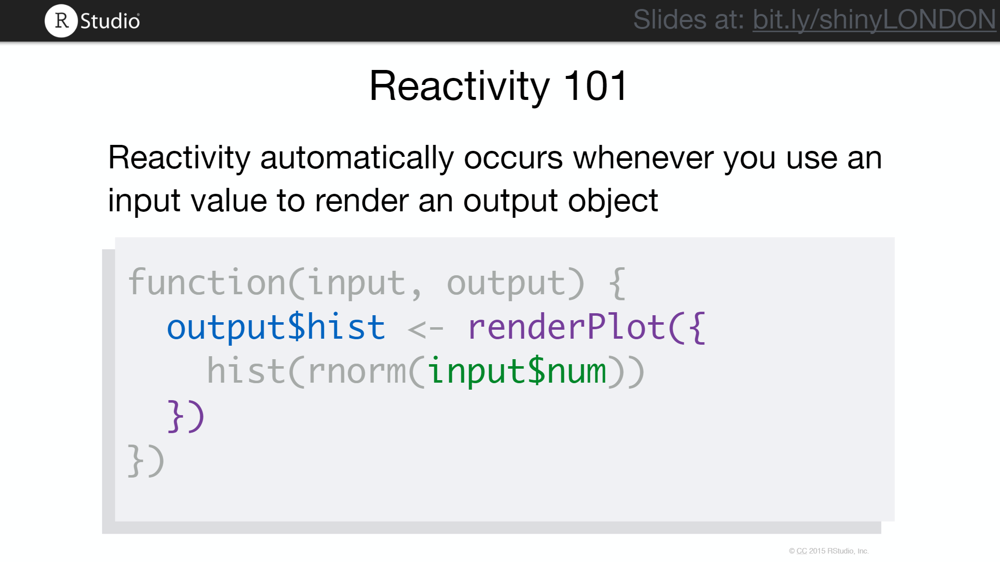
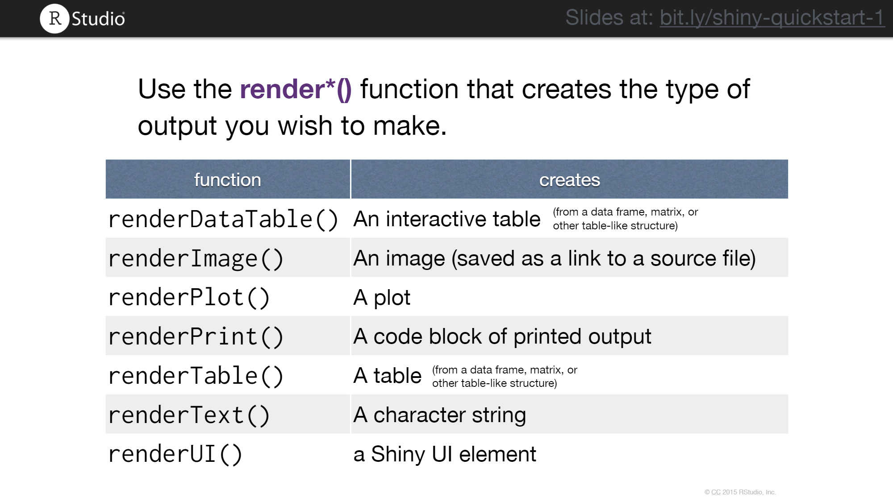
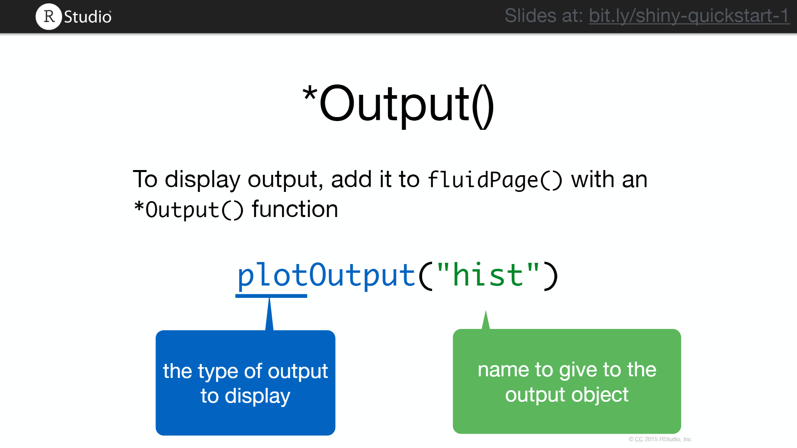
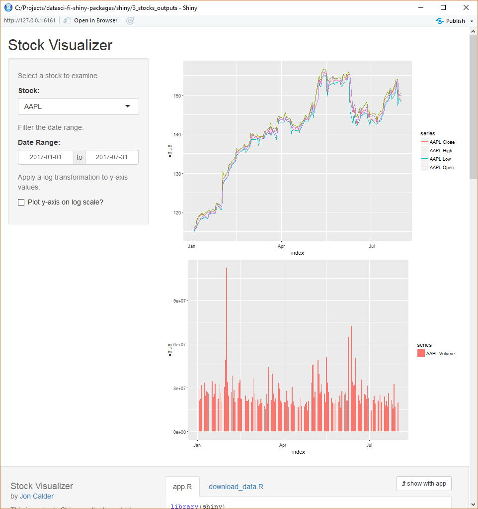

```{r setup, include=FALSE}
knitr::opts_chunk$set(echo = TRUE, eval = FALSE)
```

[Shiny](http://shiny.rstudio.com/) is an R package that makes it easy to build interactive web applications (apps) with R. This lesson will provide an overview of some of the key elements involved in building Shiny apps.

* Introduction
* Layout
* Inputs & widgets
* Outputs
* Loading from other sources
* Reactivity
* Polishing up
* Sharing
* Tips
* Learn More

## Introduction

Start by installing the `shiny` package if you haven't already done so:

```{r}
install.packages("shiny")
```

The `shiny` package has a number of built-in examples which are useful for exploring how things work.

Load the package and run the 'Hello Shiny' app as follows:

```{r}
library(shiny)
runExample("01_hello")
```

The app will launch in 'showcase' mode which allows you to inspect the source code for the app while it is running. Play with the app and look over the code just to get a feel for things.

The key thing to observe here is that there are two parts to a `shiny` app - the UI code and the SERVER code. Both the UI and the SERVER code are written in R, but the UI code generates HTML to build a web page which the R SERVER code then communicates with. 

Generally speaking, the UI is fairly static and is responsible for most of the layout and appearance of the app, whereas the SERVER is responsible for most of the processing. The SERVER code can manipulate most elements of the app (including the UI elements in some cases), in order to provide the interactivity.

Let's now look at a more complex example, which illustrates more of the flexibility and potential of `shiny` apps. It was built by the creator of `shiny` Joe Cheng:

[Scorecard App](https://beta.rstudioconnect.com/jcheng/scorecard-app/)

You can also take a look at the code for the app [here](https://github.com/jcheng5/scorecard-app). Note that the shiny app itself isn't really that complex, but is impressive because it 'shines' visually. It turns out the overwhelming majority of the source code is actually CSS!

This is an example of an app where the UI is built directly in HTML & CSS instead of via the UI builder functions which `shiny` provides. The code for the UI is contained in the `www/` directory, which contains the main page `index.html` that the `shiny` SERVER code then interfaces with.

Having looked at both a simple and a more complex example, let's now look at the smallest viable `shiny` app:

```{r}
library(shiny)

ui <- fluidPage()

server <- function(input, output) {}

shinyApp(ui = ui, server = server)
```

Even though this is just skeleton code, it is a 'runnable' `shiny` app - though it will just serve up a blank page. Also note that unlike the first example where the code for the `shiny` app was contained in separate `ui.R` and `server.R` files, here it is included together in one place. If you try and create a `shiny` app in RStudio via:

> File -> New File -> Shiny Web App...

You'll see that you are given an option to use a single file application `app.R` or a multi-file application `ui.R`/`server.R`.

```{r, eval = TRUE, echo = FALSE}
knitr::include_graphics("figures/lesson9/new_shiny_app.png")
```

Using RStudio's shiny app template (i.e. the process shown above) is a handy way to quickly get started creating shiny apps once you know what you're doing (since it provides you with a simple working example which you can immediately start iterating on and updating with your desired app elements.

For this lesson however, we are instead going to start out with the previously highlighted (four line) skeleton code and build out a `shiny` app from scratch by working through a series of five steps, illustrating the key elements (and reactive paradigm) of `shiny` as we go.

The app will be a simple interactive visualization tool for viewing financial markets price and trade volume data for a number of large technology companies. The data will be downloaded from Google via the [quantmod](https://www.quantmod.com/) package.

## Layout (Stock Visualizer - 1)

As has already been highlighted, since the frontend for a `shiny` is essentially just an HTML web page with follows certain conventions, there are a number of different options for creating the layout for a `shiny` app. These range from various UI functions provided with `shiny` to more specific frameworks like `flexdashboard` (Rmarkdown based) or `shinydashboard` (derived from AdminLTE), to the less common 'build your own custom UI with HTML & CSS' approach. Different approaches can also be mixed and matched to some extent.

Though there is a lot of variety, apart from the custom approach, all the other options have one thing in common - they provide a way for you to write R code that generates HTML. If you call functions such as `fluidPage()` or `sidebarPanel()` directly in the R console you'll see that they output `<div>` & `<form>` HTML elements.

Getting comfortable with `shiny` layouts takes a bit of practice and experimentation, but there are plenty of online resources and examples for learning (see the resources provided at the end of the lesson). For our purposes here all we need is a simple `sidebarLayout()` with a `sidebarPanel()` area for inputs and a `mainPanel()` area for outputs. We'll also add a `titlePanel()` and some `helpText()` elements where each of our inputs are going to appear later.

Note that multiple elements within each panel are separated by a comma.

```{r}
ui <- fluidPage(
  
  # Application title
  titlePanel("Stock Visualizer"),
   
  # Sidebar with a select input for the stock,
  # date range filter, and checkbox input for 
  # whether to use a log scale
  sidebarLayout(
    sidebarPanel(
      helpText("Select a stock to examine."),
      helpText("Filter the date range."),
      helpText("Apply a log transformation to the price data.")
    ),
      
    # Show price and volume plots of the selected stock over the specified date range
    mainPanel()
  )
)
```

Your code should now look like [this](https://github.com/jonmcalder/datasci-fi-shiny-packages/tree/master/shiny/1_stocks_layout).

Run your app and check the output: 

```{r, eval = TRUE, echo = FALSE}
knitr::include_graphics("figures/lesson9/1_stocks_layout.png")
```

Next we'll add some inputs to our `shiny` app.

## Inputs & widgets  (Stock Visualizer - 2)

The main building blocks for `shiny` apps are `Input` functions and `Output` functions. `Input` functions usually include 'Input' as part of their names e.g. `sliderInput()`, `selectInput()`, `fileInput()` etc.

```{r, eval = TRUE, echo = FALSE}
knitr::include_graphics("figures/lesson9/shiny_inputs.png")
```

Input functions also generally use the same basic syntax - an `inputId` and a `label`. Both values should be strings and the `inputId` needs to be unique as it is used internally to identify inputs.

```{r, eval = TRUE, echo = FALSE}
knitr::include_graphics("figures/lesson9/input_syntax.png")
```

Note that it is 'Id' not 'ID' - this is an easy and frustrating mistake to make.

We'll use a `selectInput()` for choosing which stock to view:

```{r}
selectInput("stock", "Stock:", 
                  choices = c("AAPL", "GOOG", "INTC", "FB", "MSFT", "TWTR"),
                  selected = "AAPL")
```

Then we'll add a `dateRangeInput()` for filtering the date range:

```{r}
dateRangeInput("dates", "Date Range:",
               start = "2017-01-01",
               end = "2017-07-31", 
               min = "2010-01-01",
               max = "2017-07-31")
```

And lastly we'll include a `checkboxInput()` for the log y-axis option:

```{r}
checkboxInput("log", "Plot y-axis on log scale?", 
                    value = FALSE)
```

Your code should now look like [this](https://github.com/jonmcalder/datasci-fi-shiny-packages/tree/master/shiny/2_stocks_inputs).

Run your app again and check the output: 

```{r, eval = TRUE, echo = FALSE}
knitr::include_graphics("figures/lesson9/2_stocks_inputs.png")
```

Notice that the inputs are functional/useable, but don't do anything yet since there is no output. Next we'll look at adding some outputs and making them dependent on these inputs. However, first we need to source the data that will be processed for these outputs.

## Loading from other sources

As you start adding to your `shiny` you'll find that you need to start loading R Scripts, packages, and data sets etc.

Shiny will run code placed at the start of `app.R` or before the server function, only once during the life of the app.

Keep in mind that the directory that `app.R` appears in will become the working directory of the Shiny app, so if you are sourcing any files, data etc then it will need to be done relative to that working directory.

Also be aware that `shiny` will run code placed inside the server function multiple times, which can slow down the app a lot if some of these calls are expensive. If code only needs to be run once at startup, then include it outside of the server function (i.e. at the top of `app.R` or `server.R`).

Below is some code which can be used to download stock data from Google using the `quantmod` package. This could also be done dynamically from within the `shiny` app but in this case since the app is just for illustration and learning purposes it's probably better if we pre-fetch and then save the data to disk. This then means that the app can subsequently be run without an internet connection if necessary.

```{r}
library(quantmod)
library(purrr)
library(broom)

start_date <- "2010-01-01"
end_date <- "2017-07-31"
stocks <- c("AAPL", "GOOG", "INTC", "FB", "MSFT", "TWTR")

stock_data <- stocks %>% 
  map(
    getSymbols, 
    from = start_date, to = end_date, 
    auto.assign = FALSE, src = "google"
  ) %>% 
  map(tidy) %>% 
  setNames(stocks)

save(stock_data, file = "stock_data.RData")
```

This produces a list of tidy data frames (one for each stock), which contain the columns index (date), series (variable), and value (price/volume).

With the file `stock_data.RData` saved within the same directory as `app.R`, we can now simply add the line `load("stock_data.RData")` at the top of the `app.R` script (or just before the server function) and then the stock data should be accessible within the server function.

## Outputs  (Stock Visualizer - 3)

Adding the outputs is where things start to get a little more interesting. For now you just need to accept that `shiny` follows a particular paradigm known as reactive programming, which is particularly useful for applications like this where you want your UI to be interactive. To begin with you need to learn and stick to this paradigm otherwise things will end up very broken.

To make outputs reactive you should to adhere to these 4 steps:

* Save output objects to `output$<output_id>`
* Build objects to display with `render*()`
* Access input values with `input$` within the `render*()` call
* Use an `*Output()` function in the ui to place reactive objects in your Shiny app

Also note that R expressions should be contained within curly braces {} within each `render*()` function.

From the SERVER:

```{r, eval = TRUE, echo = FALSE}

```

Other shiny render outputs:

```{r, eval = TRUE, echo = FALSE}

```

From the UI:

```{r, eval = TRUE, echo = FALSE}

```

Other shiny UI outputs:

```{r, eval = TRUE, echo = FALSE}
knitr::include_graphics("figures/lesson9/shiny_outputs.png")
```

Let's render two plot outputs for our `shiny` app. One for price data, and one for volume data.

```{r}
output$stock_price_plot <- renderPlot({
    
  price_data <- stock_data[[input$stock]] %>% 
    filter(
      between(index, input$dates[1], input$dates[2]),
      !grepl("Volume", series)
    )
  
  ggplot(price_data, aes(x = index, y = value, color = series)) + geom_line()
})

output$stock_volume_plot <- renderPlot({
    
    volume_data <- stock_data[[input$stock]] %>% 
      filter(
        between(index, input$dates[1], input$dates[2]),
        grepl("Volume", series)
      )
      
    ggplot(volume_data, aes(x = index, y = value, fill = series)) + geom_col()
})
```

We also need to load `dplyr` and `ggplot2` (which the above code uses) at the start of `app.R`.

```{r}
library(shiny)
library(dplyr)
library(ggplot2)
```

And then add each of the outputs to the `mainPanel()` in the UI:

```{r}
mainPanel(
  plotOutput("stock_price_plot"),
  plotOutput("stock_volume_plot")
)
```

Your code should now look like [this](https://github.com/jonmcalder/datasci-fi-shiny-packages/tree/master/shiny/3_stocks_outputs).

```{r, eval = TRUE, echo = FALSE}

```

As apps become more complex, they tend to become inefficient and slow. Note how in the current version of our `shiny` app, both of the outputs have to re-filter the data completely each time either the selected stock or date range are changed.

In the next section we'll look at how to use reactive expressions in order to keep processing efficient and modular.

## Reactivity  (Stock Visualizer - 4)

A reactive expression takes input values, or values from other reactive expressions, and returns a new value.

A reactive expression saves its result the first time you run it. The next time the reactive expression is called, it checks if the saved value has become out of date (i.e., whether the inputs or reactive values  it depends on have changed). If the value is up-to-date, the reactive expression will return the saved value without doing any computation. If the value is out of date, the reactive object will recalculate it (and then save the new result).

This behaviour can be used to help prevent Shiny from re-running code unnecessarily.

* Reactive expressions are created with `reactive({ })`
* Reactive expressions are later called/evaluated with the name of the expression followed by parentheses `()`
* Reactive expressions can only be called from within other reactive expressions or render* functions

Let's apply this to the SERVER code for our `shiny` app.

We need two types of filtering (stock and date range), and then also the (optional) log transformation which we didn't address in the previous section.

Stock filtering reactive:

```{r}
stock_filtered_data <- reactive({
    stock_data[[input$stock]]
  })
```

Date filtering reactive (also creates a group variable for Volume/Price):

```{r}
date_filtered_data <- reactive({
  stock_filtered_data() %>% 
    filter(between(index, input$dates[1], input$dates[2])) %>% 
    mutate(
      group = case_when(
        grepl("Volume", series) ~ "Volume",
                          TRUE  ~ "Price"
      )
    )
})
```

Log transforming reactive:

```{r}
log_filtered_data <- reactive({
  if (input$log) {
    date_filtered_data() %>% 
      mutate(value = log(value))
  }
  else {
    date_filtered_data()
  }
})
```

Given that we've chained these 3 reactives together, we can now use the last one as a common data source for each of the two plot outputs:

```{r}
output$stock_price_plot <- renderPlot({
  ggplot(
    log_filtered_data() %>% filter(group == "Price"), 
    aes(x = index, y = value, color = series)
  ) + geom_line()
})

output$stock_volume_plot <- renderPlot({
    ggplot(
      log_filtered_data() %>% filter(group == "Volume"), 
      aes(x = index, y = value, fill = series)
    ) + geom_col()
})
```

Your code should now look like [this](https://github.com/jonmcalder/datasci-fi-shiny-packages/tree/master/shiny/4_stocks_reactivity).

The app/output should remain identical to before since we have not changed the UI and have simply rewritten the SERVER code to be a little more efficient.

## Polishing up

As the final step we'll just do a little bit of refinement:

* split the code up into a separate `ui.R` and `server.R`
* use the `plotly` package to enhance the plots with further interactivity (tooltips etc)
* tidy up the plot legends

In order to use `plotly` we have to change:

* `plotOutput()` to `plotlyOutput()`
* `renderPlot()` to `renderPlotly()`
* wrap the `ggplot2` code in a call to `ggplotly()`
* add `library(plotly)` to the top of `ui.R`

The final code can be found [here](https://github.com/jonmcalder/datasci-fi-shiny-packages/tree/master/shiny/5_stocks_visualizer).

## Sharing

`shiny` apps are fairly easy to share as there are a number of options available. 

If you want to share your app with other R users, then you can simply need to share your R app scripts with them - anyone can launch your app as long as they have R, `shiny` & your code.

`runUrl()`, `runGitHub()`, and `runGist()` make it simple to retrieve `shiny` files from web links or GitHub and then run an app.

If you're looking to share your app with people who don't themselves have or use R, then you need to look at hosting and running your `shiny` app on web server. 

* The simplest option is probably [shinyapps.io](http://www.shinyapps.io/)
* You can also use the open source [Shiny Server](https://www.rstudio.com/products/shiny/download-server/) to build your own Linux server that hosts Shiny apps
* If you need commercial support, you can look at [Shiny Server Pro](https://www.rstudio.com/products/rstudio-server-pro/) or [RStudio Connect](https://www.rstudio.com/products/connect/)

## Tips

* When running `shiny` apps locally you can specify whether you want to use RStudio's browser or launch the app in your (external) web browser:

```{r}
runApp(list(ui = ui, server = server), launch.browser = TRUE)
```

If you work with a multiple virtual desktops or screens when iterating on a Shiny app and testing locally using the RStudio browser, it can be a little inefficient/frustrating that it doesn't retain its window/screen position between restarts and therefore covers your RStudio window whenever it starts up. For the sake of efficiency you might find it useful to output to the external browser window instead (since the browser can then stay open in a separate window/desktop/screen).

* `shiny`'s showcase display mode can be useful when you want to share both the app and its source code. Its dynamic code highlighting for reactive expressions is also very useful for visualizing how the code executes when you interact with the app. See this [RStudio article](https://shiny.rstudio.com/articles/display-modes.html) for more info.

* When naming things adopt a convention (`snake_case` or `camelCase`) and stick with it. If you don't you will mistype names more frequently and waste time and effort debugging missing/mismatched inputs and outputs.

* Make a habit of working in small iterative loops. First string together simple bits of functionality and then work on improving them. This is especially important while you are newer to `shiny`. If you update large chunks of code in multiple places at the same time then when something breaks or doesn't work you will have a tough job trying to work out what went wrong because it's hard to keep all the little changes in your working memory at the same time.

## Learn More

* [Shiny Dev Center](http://shiny.rstudio.com) - which contains [tutorials](http://shiny.rstudio.com/tutorial), a [gallery](http://shiny.rstudio.com/gallery/) (which includes code) and many [articles](http://shiny.rstudio.com/articles/).

* [Intro to Shiny](https://github.com/juliasilge/intro_to_shiny) - Julia Silge's workshop material from satRday Cape Town

* [flexdashboard](http://rmarkdown.rstudio.com/flexdashboard/) - a framework developed mainly around Rmarkdown which can also include `shiny` interactivity (see parts 2 & 3 of Julia's Intro to Shiny for example)

* [shinydashboard](https://rstudio.github.io/shinydashboard/) - a dashboarding framework for `shiny` based on [AdminLTE](https://adminlte.io/)

* Zev Ross's thorough [introduction to Shiny tutorial](http://zevross.com/blog/2016/04/19/r-powered-web-applications-with-shiny-a-tutorial-and-cheat-sheet-with-40-example-apps/) with over 40 example apps

* [Show Me Shiny](https://www.showmeshiny.com/) - a gallery of `shiny` app examples contributed by the #Rstats community
